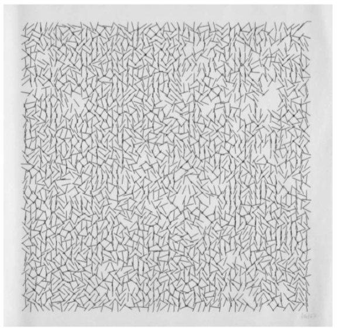

Replicating Vera Molnár – "Interruptions"

Vera Molnár (1924–2023) was a pioneering figure in generative and algorithmic art, recognized for her exploration of structure, randomness, and machine aesthetics. Interruptions (1968–69) exemplifies her approach, where a rigid grid of lines or shapes is subtly "interrupted" by controlled distortions, introducing an element of randomness within order.

I tried my best to replicate this piece and I was able to negate creating the grid structure and line elements. I however came across difficulties when trying to apply a rotation to my line elements. The replication.toe file represents my attempt at trying to replicate her work. The riff.toe represents my experimentation with different values to produce different effects. I mainly played with the noise “seed”.

